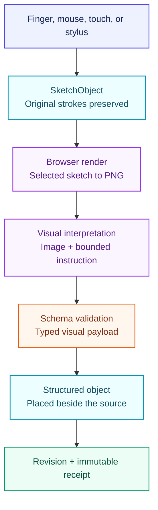
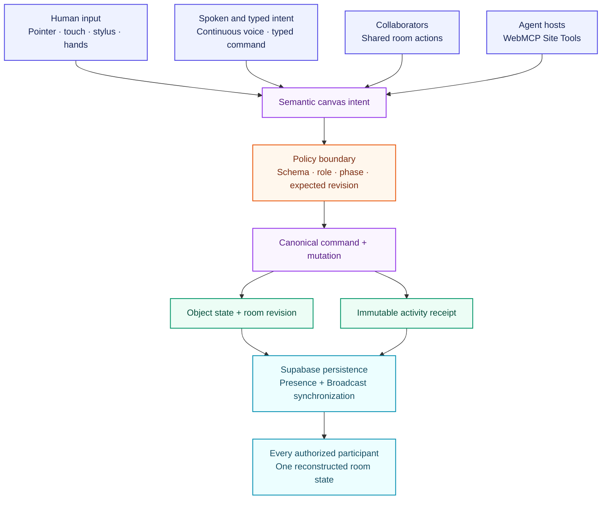
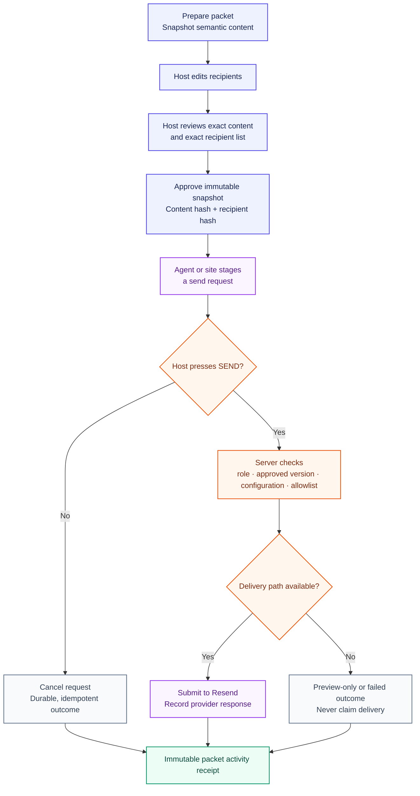

# CommandCanvas

CommandCanvas is a shared spatial workspace where people, remote collaborators, the optional Live voice agent, and, where Site Tools are supported, ChatGPT manipulate the same collection of semantic objects. Rough sketches and their spoken explanation become separate schema-validated visuals without destroying the source, and every supported canvas mutation remains attributable and reversible whether it was initiated by a human, participant, or agent.

**Product landing page:** <https://commandcanvas.vercel.app>

**Signed workspace:** <https://commandcanvas.vercel.app/meet>

**Limited judge preview:** <https://commandcanvas.vercel.app/demo>

The product is account-first. Standard rooms use a six-digit Supabase Email OTP with no password. A host can send an exact-email, 24-hour participant invitation or copy its fragment-token link. After a verified user enters a standard room, CommandCanvas can automatically select the user-owned OpenAI key they previously chose to save.

The secondary `/demo` route is a temporary, bounded competition preview. It creates a Supabase Anonymous Auth identity and capped room only after the visitor explicitly chooses **Continue limited judge preview**. It does not save an OpenAI key and cannot call Resend for production email. The repository does not create or use a Supabase Storage bucket. Supabase’s browser publishable key is intentionally public; private service credentials remain server-side, and room data is protected by membership-scoped RLS and private Realtime topics.

A verified non-anonymous `/meet` user may explicitly save, replace, or delete their own OpenAI API key. Saved keys are encrypted through Supabase Vault. The raw saved value is never returned to the browser; the server resolves it only at the OpenAI provider boundary. Saving is optional, and it never creates a deployment-owner fallback.

## The product thesis

The canvas is not a document and the agent is not a detached chat panel. Notes, boards, schedules, sketches, diagrams, and charts are typed application objects with stable identities, spatial geometry, versions, and payload schemas. WebMCP exposes bounded Site Tools over those same live objects and selected state to supported agent hosts. Where ChatGPT Site Tools are available, ChatGPT can use those capabilities against the page and session that human participants see.

That makes the core interaction possible:



The current validated output kinds are a generic diagram, architecture diagram, flowchart, pie chart, bar chart, and line chart. In auto mode, the transformation selects the best supported kind from the sketch image, the user’s bounded spoken explanation, and the instruction. Architecture is one possible subject, not a product or audience boundary.

## Limited judge preview path

1. Open <https://commandcanvas.vercel.app/demo>, review the temporary-resource boundary, and choose **Continue limited judge preview**. Merely opening the route does not create an anonymous identity or room.
2. Open the command drawer. To use embedded Live voice, enter your own OpenAI API key in **Your OpenAI API key**, press **Start**, and say **Bring in our project board**. The `gpt-realtime-2.1` session listens for later commands until the user stops it or the bounded session ends. There is no Run button in this path. The key remains only in memory for the current tab. If you do not provide a key, typed **Human command** plus **Run** remains the fallback.
   To capture a note without reaching for a mouse, say **Start a new thought**. CommandCanvas creates and selects one **New thought** card only after the canonical create command succeeds. Continue speaking normally: each completed user turn is appended as speech-to-text inside that same card. The start and finish phrases and the assistant's speech are excluded. Say **Finish thought** to close the capture.
3. Click **Sketch** and draw a rough relationship map, flow, or labeled data chart, or enable Hand input, choose **Draw**, and trace it directly on the main canvas with your index finger. The camera preview is only a sensor check; the complete canvas is the spatial control plane. While drawing, explain its labels or values in Live voice. Multiple lines remain one active sketch instead of spawning objects or drawers. Finish the sketch, select it, and say **Make this sketch professional**. Direct OpenAI interpretation uses the same per-tab key and refuses honestly when no valid key is present.
4. Keep the rough sketch visible beside the auto-selected, schema-validated visual. Move, resize, rotate, pin, minimize, restore, trash, recover, undo, and redo through named controls.
5. Turn on **Select many**, choose two objects, group them into a semantic frame, move the frame, then ungroup it.
6. Click **Prepare meeting packet**, review the exact content and recipient, then approve it.
7. Click **Request email send**. The agent or site stages the action; only the host can press **SEND**. The limited judge preview always records **Preview only: not sent** and never calls Resend.
8. Click **Copy invite** and open the link in a private window to exercise Supabase Presence, cursor Broadcast, a participant mutation, and the opt-in peer-to-peer meeting filmstrip.

Use **Reset demo** to remove the current temporary room and return to a clean deterministic room. Reset does not bypass the durable model and voice admission limits.

Detailed instructions are in [docs/judge-instructions.md](docs/judge-instructions.md). The evidence ledger is in [docs/verification-ledger.md](docs/verification-ledger.md).

## WebMCP tool catalog

The site registers ten stable tools through
`document.modelContext.registerTool(...)`. The catalog is grouped by authority so
it remains scannable on narrow screens.

### Observe

- **`get_canvas_state`** (**Read only**): Returns a bounded semantic projection
  of current objects, selection, and
  recent receipts. It cannot mutate the room.

### Create and transform

- **`create_object`** (**Write**): Creates one validated note, task board,
  schedule, sketch, structured visual,
  frame, data table, reference card, or meeting card through the canonical
  mutation path and records a receipt.
- **`transform_object`** (**Write**): Moves, resizes, or rotates one unpinned
  object through the canonical mutation
  path and records a receipt.
- **`set_object_state`** (**Write**): Pins, unpins, minimizes, or restores an
  object through the canonical mutation
  path and records a receipt.
- **`discard_object`** (**Reversible write**): Moves an object to recoverable
  trash. It never permanently deletes the
  object.
- **`organize_objects`** (**Reversible write**): Groups explicit objects into a
  semantic frame or ungroups one frame, then
  records the canonical receipt.
- **`history_action`** (**Reversible write**): Undoes or redoes the latest
  eligible shared mutation through the same history
  boundary.

### Interpret

- **`transform_sketch`** (**Write; source preserved**): Interprets the selected
  sketch and optional narration into a new structured
  visual beside the original.

### Prepare and deliver

- **`prepare_meeting_packet`** (**Draft write**): Creates or refreshes a
  reviewable packet draft. It cannot approve or send the
  packet.
- **`request_packet_send`** (**Consequential request**): Stages an approved
  packet for site confirmation. The external effect still
  requires the host to press **SEND**.

Descriptors use strict input schemas, `readOnlyHint`, `untrustedContentHint`, invocation cancellation signals, and registration lifecycle abort signals. Static registration is the default. Dynamic phase registration is available behind `NEXT_PUBLIC_WEBMCP_DYNAMIC_REGISTRATION=true`; both modes use the same execute-time room, phase, schema, selection, membership, and role guards.

The compact canvas projection has a hard 32,768-byte envelope. It prioritizes selected objects and excludes rough-sketch coordinates and reversible before/after snapshots from agent context.

## Continuous voice and ChatGPT Site Tools

These are distinct agent surfaces with different authority:

- **Continuous in-page voice** opens a regular `gpt-realtime-2.1` WebRTC session only after the user supplies a temporary key or explicitly chooses a saved account key, then presses **Start**. It uses a narrower set of canvas tools for note, board, schedule, sketch, selected-object state, local focus, grouping, ungrouping, rotation, undo, redo, recoverable trash, thought capture, and sketch transformation. Saying **Start a new thought** creates and selects one note card, then completed user turns are serialized into that card as speech-to-text until **Finish thought**. Boundary commands and assistant speech are never appended. Each accepted turn is a version-checked canonical mutation with a receipt and the same Undo behavior as other object edits. While thought capture is active, unrelated canvas tools are refused so command speech cannot leak into the note. Completed user speech outside thought capture is bounded and can accompany the next selected-sketch transformation as untrusted explanatory context. A spoken discard request is explicit and recoverable through the same receipt and Undo path; it never permanently deletes data. Live voice cannot manage rooms, approve packets, stage email, or send email. Except for local-only focus, a successful voice tool result means the action was submitted to the canonical command path; the shared receipt is the completion record.
- **ChatGPT Site Tools**, where supported by the current ChatGPT host rollout, use the ten WebMCP tools registered on the same live page through `document.modelContext`. They use the ChatGPT account already signed into the surrounding ChatGPT host. CommandCanvas never receives that ChatGPT credential. They can read current canvas state, mutate semantic objects, organize objects, transform a sketch, prepare a packet, and stage an approved send. Normal room, phase, role, revision, and human-confirmation guards remain authoritative. Native Chrome discovery and in-page Realtime voice are separate verification boundaries.

ChatGPT subscription and authentication do not supply or pay for OpenAI API usage inside CommandCanvas. In the limited `/demo` judge preview, embedded Live voice and direct sketch interpretation use the person's own key, entered per tab and held only in browser memory. That temporary key is sent transiently to same-origin authenticated routes and is not written to the URL, `localStorage`, `sessionStorage`, Supabase, receipts, or application logs. The server necessarily sees it while forwarding the requested operation.

A verified non-anonymous `/meet` user may explicitly save, replace, or delete their own key. CommandCanvas encrypts that account-owned key through Supabase Vault. The raw saved value is never returned to the browser, and the server resolves it only at the provider boundary. Use a project-scoped key with an appropriate budget. Neither path has a deployment-owner OpenAI key fallback. Live voice retains durable admission limits and a ten-minute client session ceiling. It is not a substitute for WebMCP, and a verified Realtime provider session is not evidence that ChatGPT or Chrome discovered the Site Tools catalog.

## One command architecture



Pointer previews, hand landmarks, and remote cursors remain ephemeral. A stable spatial operation commits once through the same expected-revision mutation boundary used by WebMCP and collaborator actions.

## Realtime split

- **Postgres:** rooms, memberships, semantic object state, immutable canvas receipts, meeting packets, immutable packet activity, send requests, outbound-share records, and durable vision admission.
- **Presence:** actual connected participant identity, display name, color, and role.
- **Broadcast:** bounded high-frequency cursors and compact revision notifications. Cursor movement is never persisted to Postgres.
- **Late join/reload:** rebuild stable state from Postgres, then reconnect Presence and Broadcast.
- **Network recovery:** preserve the mounted canvas while offline, then replace the failed private channel, refresh Realtime authorization, and retrack Presence when the browser returns online. Terminal channel failures use a bounded, disposal-aware retry policy, and reloaded participants resume cursor ordering immediately.
- **Long-lived rooms:** Supabase token refresh rotates the room, vision, packet, and subsequent Realtime recovery credentials without a page reload.

## Camera and privacy

Browser hand tracking uses the Apache-2.0 MediaPipe Tasks Vision package and its 21-keypoint Hand Landmarker. The generated module worker is same-origin; the official model is retrieved from Google's published URL only after the user enables hand input. If the worker canvas/runtime path fails, CommandCanvas uses the same MediaPipe model through an explicitly labeled in-page recovery endpoint rather than silently substituting another detector.

The gesture vocabulary maps a deliberate tracked index-finger point to direct drawing on the main canvas, one-hand pinch to magnetic grab and move, and two-hand pinch span over an object to resize. In drawing mode, an open palm lifts the pen. Over blank canvas, an open-palm drag pans the local viewport and a two-hand spread or pinch zooms it around the tracked midpoint. These viewport changes are local view state, so they do not create shared mutation receipts. Drawing mode accumulates repeated lines into one `SketchObject`; it never opens a drawer per stroke. Deliberately releasing a held object through either side edge moves it into recoverable trash after a short exit animation, with a receipt and universal Undo. Releasing it into the blue bottom dock minimizes it. No gesture permanently deletes data and neither edge path opens a confirmation panel.

The camera's comfortable central tracking region maps across the full canvas, so a person does not need to reach to the physical edges of a small preview to reach the workspace edges. The preview is an optional sensor and skeleton check, not an interaction boundary. The system drawer closes when spatial input begins and the on-canvas feedback names what the tracker currently understands, including target, open-hand, pinch, held-object, resizing, panning, and canvas-zoom states. They make an accepted gesture visible; they are not a claim that every physical hand, camera, lighting condition, or device has passed calibration.

The camera panel includes a session-local self-check. It records point and pinch separately and reports success only after both observations actually occur in that camera session. This is a calibration aid, not a claim that every webcam, hand, or lighting condition has been validated.

Hand tracking is local by default. MediaPipe processes camera frames inside the browser and exposes only semantic landmarks to the canvas command layer.

A separately operated private CUDA relay may be configured as an explicit opt-in. Only while **Use private GPU hand tracking** is on and Hand input is active may the browser encode one bounded JPEG or WebP frame at a time and send it to the configured relay origin. That separately distributed service runs the pinned GPU hand-pose model, does not retain raw frames, and returns only bounded semantic landmarks. Turning consent off, disabling Hand input, hiding or leaving the page, or a relay failure closes the remote path and restores local MediaPipe processing. Camera frames are never sent to ChatGPT, OpenAI, Supabase, or WebMCP in either mode. Every camera action has pointer and button equivalents. The exact AGPL corresponding source used by the current image is public at [`ee5c2afcfbfc8427b39e2f13e170785c87bce2e3`](https://github.com/romiteld/commandcanvas/tree/ee5c2afcfbfc8427b39e2f13e170785c87bce2e3) on the isolated `hand-relay-source` branch; it is separate from this MIT web-application distribution.

Continuous voice has a separate and explicit privacy boundary. Microphone audio travels to OpenAI only while the user-visible **Live voice** session is on, and assistant audio returns over that WebRTC connection. On `/demo`, the user-entered API key remains in memory for the current tab and is sent transiently to the same-origin authenticated session route. A verified non-anonymous `/meet` user can instead choose to save an account-owned key encrypted through Supabase Vault; the raw saved key never returns to the browser, and the server resolves it only while creating the provider call. Neither route has a deployment-owner fallback. Typed commands remain available when continuous voice is disabled or unavailable. The older reviewed browser-transcription control may use the browser vendor's speech service under that browser's policy, but it never executes a transcript until the user presses **Run**.

Meeting audio and video are separate again. They start only after **Start camera + mic** and travel peer-to-peer between authorized room browsers. Supabase transports bounded signaling messages, not media. **Stop sharing video** detaches the published video track; if Hand input is still consuming the physical source locally, the interface says so rather than claiming that the camera device stopped. Meeting video is never sent to OpenAI. If Live voice is also on, microphone audio is separately sent to OpenAI for that voice session. CommandCanvas does not implement call recording.

The model provenance, runtime package, retrieval boundary, and license references are recorded in [THIRD_PARTY_NOTICES.md](THIRD_PARTY_NOTICES.md).

## Optional meeting media

Small-room meeting media starts only after a participant explicitly presses **Start camera + mic**. Audio and video then travel directly between browsers over WebRTC. Supabase carries signaling rather than media, and CommandCanvas sends and accepts only schema-validated, size-bounded SDP and ICE envelopes on the dedicated private `room-media:<room-id>` topic. The interface supports at most four present participants and refuses to start, or stops active media, when a fifth participant joins.

This is deliberately a best-effort direct-media layer rather than production conferencing infrastructure. It uses a public Google STUN server and has no TURN relay or SFU, so restrictive or symmetric NATs can prevent a connection. ICE negotiation can disclose network-address information to authorized room participants, and the STUN provider observes traversal requests.

Supabase Realtime authorization proves that a signaling publisher is an authenticated member of the private media topic. In this MVP, the Broadcast payload's `senderId` is not cryptographically bound to that authenticated identity, so participant attribution assumes cooperative room members and must not be treated as strong remote-identity authentication. The exercised two-browser path used controlled browser media on one test host. Physical devices, cross-network traversal, and restrictive NAT behavior remain unverified. The slice does not include recording, screen sharing, media relaying, production conferencing scale, or automatic reconnection after a failed direct peer connection.

## Human-authorized packet delivery

Packet preparation snapshots the exact semantic content. Approval snapshots exact recipients and hashes both content and recipients. WebMCP can stage an approved send but cannot change recipients or perform the external effect by itself.



Cancellation is durable and idempotent. A cancelled request cannot later execute. The limited `/demo` judge preview is always preview-only and never calls Resend. Eligible standard rooms can submit a packet only when the API key, verified sender, approved recipient snapshot, exact recipient allowlist, and explicit host authorization are all present; otherwise the application records an honest preview-only or failed outcome without a delivery claim.

## Passwordless rooms, invitations, and email boundaries

CommandCanvas has three distinct email paths:

1. **Supabase Auth OTP:** `/meet` calls `signInWithOtp` and verifies the user-entered six-digit token with `verifyOtp({ type: "email" })`. Supabase Auth sends this mail through its configured mailer. If Resend is selected as custom SMTP, its SMTP credential lives in Supabase Auth configuration and never enters the browser.
2. **Meeting invitation:** an authenticated host creates an exact-email, participant-only invitation. The database stores only the SHA-256 token digest and normalized email, applies durable issuance limits, and accepts it once in a transaction. The host-authorized Next.js server may submit that exact invitation through the Resend HTTPS API when its provider configuration is present. Invitation recipients do not use an address allowlist. Missing or rejected provider configuration leaves the host with an honest copy-link fallback.
3. **Meeting packet:** after the host reviews and approves an immutable content and recipient snapshot, WebMCP or the site may stage a send request. Only an explicit host **SEND** authorizes the Resend HTTPS API call. Packet recipients must match the server-side packet allowlist. The limited judge preview remains preview-only regardless of provider configuration.

Invitation links use `/meet#invite=...`. The fragment is never sent in an HTTP request. The client reads it once, scrubs it before constructing a Supabase client or making application calls, and presents the normal email OTP flow. Acceptance compares the verified top-level Supabase Auth email with the invitation email and atomically creates participant membership while consuming the invitation.

## Technology

- Next.js 16.3.3, React 19.2.8, TypeScript, Zustand, Zod, Tailwind CSS
- Custom DOM/SVG infinite canvas with explicit screen/world coordinate transforms
- Supabase Postgres, Anonymous Auth, Realtime Presence, and Broadcast
- Browser WebRTC for optional direct small-room audio and video
- WebMCP `document.modelContext.registerTool(...)`
- OpenAI `gpt-realtime-2.1` over WebRTC for optional continuous in-page voice
- OpenAI Responses image input and strict structured output
- MediaPipe Tasks Vision and its 21-keypoint Hand Landmarker for local browser input
- Optional separately distributed private CUDA relay behind explicit per-session camera-upload consent
- Vercel Functions and deployment
- Optional Resend delivery

## Local development

Requirements:

- Node.js 22.14–22.x (`.nvmrc` pins 22.17.0)
- npm 11.5.2
- A Supabase project with Anonymous Auth enabled for `/demo` and Email Auth
  enabled for normal `/meet` rooms
- A project-scoped OpenAI API key owned by the person using optional Live voice
  or direct sketch interpretation. `/demo` keeps it only for the current tab;
  a verified non-anonymous `/meet` user may explicitly save it encrypted.

```bash
git clone https://github.com/romiteld/commandcanvas.git
cd commandcanvas
nvm use
npm ci
cp .env.example .env.local
```

Apply the SQL files in `supabase/migrations/` to a fresh project in filename order. Then populate `.env.local`:

```dotenv
NEXT_PUBLIC_SUPABASE_URL=https://your-project.supabase.co
NEXT_PUBLIC_SUPABASE_PUBLISHABLE_KEY=sb_publishable_replace_me
SUPABASE_SECRET_KEY=replace_me
OPENAI_VISION_MODEL=gpt-5.6-terra
REALTIME_VOICE_ENABLED=false
NEXT_PUBLIC_WEBMCP_DYNAMIC_REGISTRATION=false
COMMANDCANVAS_PUBLIC_URL=https://your-commandcanvas.example
COMMANDCANVAS_INVITE_TOKEN_SECRET=
RESEND_API_KEY=
RESEND_FROM=
RESEND_WEBHOOK_SECRET=
COMMANDCANVAS_EMAIL_ALLOWLIST=
PRIVATE_HAND_RELAY_ENABLED=false
PRIVATE_HAND_RELAY_ORIGIN=https://hands.example.com
PRIVATE_HAND_RELAY_SIGNING_KEY=
PRIVATE_HAND_RELAY_TOKEN_TTL_SECONDS=60
```

The Supabase server credential, invitation secrets, Resend credentials, and private-relay signing key are server-only. Do not prefix them with `NEXT_PUBLIC_`. OpenAI credentials are user-owned rather than deployment environment variables in this architecture. Verified non-anonymous account storage uses Supabase Vault.

`REALTIME_VOICE_ENABLED=false` keeps embedded Live voice off. When enabled, a limited judge-preview user must enter a valid temporary key for that tab; a verified non-anonymous standard-room user may explicitly save an encrypted account key. Missing credentials fail closed without a deployment-owner fallback. Eligible preview rooms and verified standard-room members pass through durable actor, room, and global admission limits before a provider call.

Start the app:

```bash
npm run dev
```

Open <http://localhost:3000/meet> for the passwordless meeting lobby or
<http://localhost:3000/demo> for the limited judge preview.
Open <http://localhost:3000/local> for the local-only canvas fallback when
hosted collaboration is unavailable.

### Supabase passwordless Auth configuration

Normal rooms use Supabase Email OTP only. There are no password fields or
password credentials in this flow. In the Supabase dashboard:

1. Keep **Anonymous Sign-Ins** enabled for the isolated `/demo` path.
2. Enable the **Email** provider for `/meet`.
3. Put the same six-digit-code experience in both the **Confirm signup** and
   **Magic Link or OTP** templates. Include `{{ .Token }}` in each template and
   omit `{{ .ConfirmationURL }}`. A first-time address receives Confirm signup;
   an existing address receives Magic Link or OTP. Both are verified with
   `verifyOtp({ type: "email" })`.
4. Set the Site URL to the canonical deployment origin and allow both the
   production origin and `http://localhost:3000` in redirect URLs. The current
   six-digit-code flow does not consume a redirect token, but these settings
   keep other Supabase Auth callbacks on approved origins.
5. Configure custom SMTP before testing arbitrary external addresses. When
   using Resend SMTP, set host `smtp.resend.com`, port `465`, username `resend`,
   the Resend key as the Supabase-held SMTP password, and a verified sender.
   This is Supabase Auth mail, not either CommandCanvas Resend API workflow. If
   the mail provider refuses or rate-limits a code, CommandCanvas reports that
   failure and does not pretend the participant signed in.

Invitation capabilities use `/meet#invite=...`, not a query string. The client
reads the fragment once and immediately scrubs it before constructing a
Supabase client or making application requests. Acceptance then verifies the
authenticated user's canonical top-level `auth.users.email`, inserts the
participant membership, and consumes the invitation in one database
transaction. `/demo` remains a limited preview and does not require Email Auth.

Configuration references: [Supabase passwordless email](https://supabase.com/docs/guides/auth/auth-email-passwordless),
[email templates](https://supabase.com/docs/guides/auth/auth-email-templates),
and [custom SMTP](https://supabase.com/docs/guides/auth/auth-smtp).

### Optional Resend delivery

```dotenv
RESEND_API_KEY=replace_me
RESEND_FROM=CommandCanvas <verified-sender@example.com>
RESEND_WEBHOOK_SECRET=replace_me
COMMANDCANVAS_EMAIL_ALLOWLIST=allowed-one@example.com,allowed-two@example.com
COMMANDCANVAS_PUBLIC_URL=https://your-commandcanvas.example
COMMANDCANVAS_INVITE_TOKEN_SECRET=replace_with_a_server_only_secret
```

An authenticated host can submit an exact-email room invitation without an
address allowlist after the invitation is durably admitted. Meeting-packet
recipients use `COMMANDCANVAS_EMAIL_ALLOWLIST` and also require an immutable
approval snapshot plus explicit host **SEND**. The limited judge preview never calls
Resend. Missing, mismatched, rejected, or failed configuration produces an
explicit copy-link, preview-only, or failed result; it never claims that mail
was sent or delivered.

### Optional private CUDA relay

The four `PRIVATE_HAND_RELAY_*` values in the application environment authorize
short-lived sessions from CommandCanvas to a separately configured relay. They never
belong in `NEXT_PUBLIC_*` values. The service, model, container, and edge
operations are deliberately excluded from this MIT application branch and are
published under AGPL-3.0-only on the isolated
[`hand-relay-source`](https://github.com/romiteld/commandcanvas/tree/hand-relay-source)
branch. The application-side boundary is in
[docs/private-hand-relay.md](docs/private-hand-relay.md). The application and
service share only the independently generated signing key and versioned
protocol.

## Verification

The local build and unit gate is:

```bash
npm run check
```

Individual checks:

```bash
npm run lint
npm run typecheck
npm test
npm run build
npm run test:e2e
```

Native-relay service and edge-operation gates live in the separately licensed
relay repository and are not part of this application build.

The integrated source gate runs ESLint, TypeScript, the complete current Vitest suite, the generated MediaPipe hand worker, and the optimized application build. Coverage includes object schemas, command mutations, stale-revision refusal, undo and redo, multi-selection, grouping, ungrouping, rotation, thought-card speech-to-text lifecycle and conflict recovery, persistence projection, RLS/RPC contracts, WebMCP schemas and guards, bounded agent context, GPT Realtime admission and tool truthfulness, PNG validation, durable vision admission, MediaPipe detector and worker contracts, packet approval/cancel/execute transitions, private-relay client security and fallback, shared-camera shutdown, responsive rendering, Realtime adapters, OTP invitations, and demo reset. Time-scoped command output and counts belong in the verification ledger instead of this README.

Environment-specific browser probes are separate so their claims stay narrow:

```bash
# Ordinary Chromium plus the focused iPhone-profile WebKit checks
npx playwright test e2e/realtime-input.spec.ts \
  --project=chromium-desktop \
  --project=webkit-mobile-safari

# Official Chrome 153 binary with WebMCP enabled
WEBMCP_CHROME_PATH=/path/to/chrome-153 \
WEBMCP_BASE_URL=https://commandcanvas.vercel.app \
WEBMCP_EXPECTED_MODE=static \
WEBMCP_LIVE_PROBE=true \
npx playwright test --config=playwright.webmcp153.config.ts
```

The Chrome 153 test refuses to run against another major version, defaults to loopback, and requires `WEBMCP_LIVE_PROBE=true` before it may target a public origin. Its optional local-to-production API proxy accepts only `https://commandcanvas.vercel.app` and only the exact room endpoints used by the probe. Dynamic mode uses the same probe with `WEBMCP_EXPECTED_MODE=dynamic` against a build created with `NEXT_PUBLIC_WEBMCP_DYNAMIC_REGISTRATION=true`.

Current browser evidence is narrower than the complete source surface. Two authenticated browser contexts passed Supabase collaboration and peer-to-peer media with live local and remote tracks. Earlier paid `gpt-realtime-2.1` and OpenAI image-interpretation runs verified those provider capabilities under the credential architecture of their named commits. They do not verify the current user-key handoff, absence of an owner-key fallback in a public deployment, or a current BYOK provider session. Earlier browser YOLO and native CUDA evidence belongs to the superseded combined AGPL build and does not verify the current MIT browser engine. The exact MediaPipe-only production release completed controlled-media desktop and mobile camera lifecycle runs, including worker, model, WASM, labeled desktop recovery, detachment, and track shutdown behavior. Those controlled runs do not verify physical-hand accuracy or ergonomics. A real screen recording previously showed the UI recognizing open-palm state and pinch ratios between 0.22 and 0.28 while also exposing the old preview-boundary usability failure that the full-canvas control plane addresses; that recording is not current-engine proof. A controlled allowlisted packet completed the full approval and explicit-SEND path, received a Resend provider ID, and was reported delivered by Resend. The public limited judge preview remains preview-only to prevent anonymous email abuse. ChatGPT built-in-browser Site Tools, a live BYOK provider run on the exact release, post-fix physical iPhone and real-hand interaction quality, cross-network media, and TURN behavior remain unverified.

The [verification ledger](docs/verification-ledger.md) distinguishes:

- **WORKING:** automated or local runtime evidence
- **VERIFIED IN BROWSER:** an observed named-browser interaction
- **UNVERIFIED:** implemented or designed but not exercised at the real boundary
- **CUT:** deliberately outside the submission scope

## Security boundaries

- Natural language never writes directly to database tables.
- Browser callers cannot invoke privileged room, mutation, packet, or vision RPCs.
- Server routes derive the actor from a verified Supabase bearer token and ignore client-supplied authority.
- Stable mutations use expected room revisions and fail closed on stale state.
- Destructive object actions use recoverable trash and universal undo.
- Packet content and recipients are immutable after approval.
- External delivery requires explicit host authorization and a server-side recipient allowlist.
- Paid vision work uses actor/room limits, one active room lease, exact-request caching, and compare-and-set completion.
- Embedded Live voice and direct sketch interpretation require the person's own OpenAI API key. `/demo` keeps the key only in browser memory for the current tab. A verified non-anonymous `/meet` user may explicitly save, replace, or delete an account key encrypted through Supabase Vault. A raw saved key is never returned to the browser; the server resolves it only at the provider boundary. Neither route has a deployment-owner fallback.
- The complete vision JSON body is capped at 4 MB and decoded PNG data at 2 MB, below Vercel Functions' 4.5 MB payload ceiling.
- Private-relay sessions require current room membership, explicit camera-upload consent, durable admission, a short-lived HMAC capability, an exact Origin, and one-use replay protection.
- Raw camera frames and private-relay credentials never enter WebMCP, OpenAI, ChatGPT, or Supabase context. User-owned OpenAI keys follow only the temporary-tab or encrypted-Vault provider boundaries described above. The opt-in relay receives bounded camera frames only while active, does not retain them, and returns semantic landmarks.

## Deliberate scope cuts

This submission does not include production conferencing infrastructure, TURN or SFU media relaying, recording, screen sharing, conferencing-platform integrations, enterprise identity, broad document-suite integrations, billing, native mobile or headset apps, physical marker tracking, or permanent gesture deletion. Side-edge throws use recoverable trash and universal Undo.

Mouse, keyboard, touch, and named buttons remain the guaranteed interaction baseline.

## Submission material

- [Devpost description draft](docs/devpost-submission.md)
- [90-second video shot list](docs/video-shot-list.md)
- [One-click judge instructions](docs/judge-instructions.md)
- [Verification ledger](docs/verification-ledger.md)
- [Third-party notices](THIRD_PARTY_NOTICES.md)

## License

[MIT License](LICENSE) © 2026 Daniel Romitelli. See the application
[source and license boundary](SOURCE.md) and
[third-party notices](THIRD_PARTY_NOTICES.md). The optional private GPU relay is
a separately distributed service and is not licensed or bundled as part of
this application repository.
